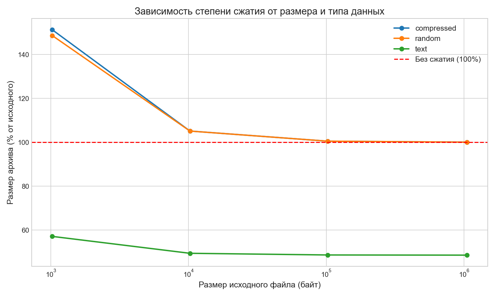
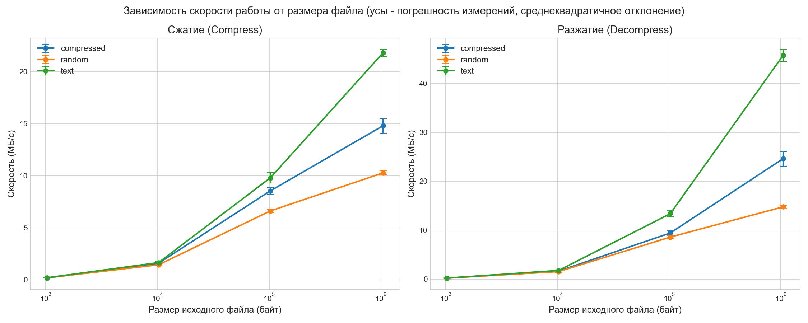

# huffman-archiver

CLI архиватор на базе статического канонического алгоритма Хаффмана.

---

### Built With


---

### Требования

Для сборки и запуска проекта из исходного кода требуется:

- `Go`: версия 1.24.0 или выше.

- `Python`: версия 3.8 или выше (только для запуска скриптов автоматизированного тестирования и бенчмарков).

---

### Архитектурные особенности

- Потребление памяти O(1): используется двухпроходный алгоритм с `io.ReadSeeker` и буфером чтения 32 КБ. Архиватор может сжать файл любого размера, ограниченный только свободным местом на диске.

- Каноническое кодирование: вместо хранения самих кодов в заголовке архива, сохраняются только их длины. Это позволяет восстанавливать коды математически, сокращая размер заголовка (максимум 525 байт вместо нескольких килобайт).

- Отказ от рефлексии в I/O: запись заголовка реализована через `binary.LittleEndian.PutUint64` и пакетную запись слайсов байт, что исключает накладные расходы `binary.Write` и минимизирует количество системных вызовов (Syscalls).

- Буферизация потоков: использование `bufio.Reader` и `bufio.Writer` предотвращает обращения к диску на каждый байт при побитовом чтении/записи.

---

### Сборка

Для компиляции проекта в бинарный файл (выполните из корня репозитория):
```bash
go build -o huff ./cmd/huff
```

---

### Использование

Программа поддерживает два режима работы: сжатие и распаковка.

**Сжатие файла:**
```bash
./huff -c input.txt archive.huff
```

**Распаковка файла:**
```bash
./huff -d archive.huff output.txt
```

---

### Тестирование и CI

Проект покрыт модульными тестами (побитовый I/O, математика канонических кодов, крайние случаи деревьев) и интеграционными тестами (побайтовое сравнение сжатого и разжатого файла в памяти).

В репозитории настроен GitHub Actions (`.github/workflows/ci.yml`). При каждом Push/Pull Request автоматически запускается go vet и полный набор тестов на чистой среде Ubuntu.

Запуск всех тестов (интеграционные и модульные):
```bash
go test -v ./...
```

---

### Экспериментальное исследование

#### Конфигурация для замеров производительности

- Операционная система: Windows 10 Pro x64

- Процессор (CPU): AMD Ryzen 7 5800H, 8 ядер

- Оперативная память: 16 ГБ DDR4 3200MHz

- Накопитель: NVMe SSD SK Hynix BC711 512 Gb

- Версия компилятора Go: 1.24.0

- Ключи компиляции: стандартные (go build), без дополнительных флагов оптимизации или профилирования.

#### Методология

Было проведено исследование эффективности алгоритма на данных разных типов и размеров.
Замеры проводились автоматически (Python-скриптом) по 15 прогонов на каждом файле. На графиках отображено матожидание, а также для оценки стабильности работы алгоритма на графиках отображены доверительные интервалы, соответствующие среднеквадратичному отклонению (σ).

#### Степень сжатия



- Текстовые данные: алгоритм демонстрирует высокую эффективность (сжатие до 50-52% от оригинала). Это связано с неравномерным распределением символов в естественных языках.

- Случайные и уже сжатые данные: показатели данных этих типов стабилизируются на уровне 100% и выше. Поскольку байты распределены равномерно (максимальная энтропия), алгоритм не находит повторений и вынужден выдавать каждому символу код длиной 8 бит. Из-за добавления заголовка архива (525 байт) итоговый размер файла становится больше исходного.

- Влияние размера файла: на графике видно, показатели стабилизируются с ростом объема. Это доказывает, что накладные расходы на заголовок фиксированы.

#### Скорость работы



- Амортизация системных расходов: cкорость (в МБ/с) нелинейно возрастает с ростом размера файла. На малых файлах (1–10 КБ) время работы сильно искажается накладными расходами ОС на запуск самого процесса `./huff` и аллокацию структур. Начиная с 100 КБ эти издержки становятся незначительными, и график показывает реальную чистую пропускную способность алгоритма.

- Разжатие быстрее сжатия: на правом графике (Decompress) скорость стабильно выше, чем на левом (Compress). При разжатии отсутствуют тяжелые операции (подсчет частот, работа с приоритетной очередью `heap`, сортировка). Декодирование сводится к простым переходам по указателям дерева, которое целиком помещается в кэш процессора.

- Влияние типа данных на скорость декомпрессии: линии для разных типов данных расходятся. Текстовые файлы обрабатываются быстрее случайных, что связано со степенью сжатия: так как текст сжимается сильно, декомпрессору нужно прочитать из архива в 2 раза меньше бит, чтобы выдать 1 МБ оригинальных данных. Для случайных данных (максимальная энтропия) приходится читать и обрабатывать каждый бит входного потока, что логично снижает итоговую скорость в МБ/с.

---

### Воспроизведение исследования (Benchmarks)

Все скрипты для генерации данных и построения графиков лежат в папке benchmarks. Для их работы требуется установленный Python 3 и библиотеки `matplotlib`, `pandas`.

_Примечание: сами сгенерированные файлы, графики и `results.csv` уже лежат в репозитории для наглядности._

1. Установить зависимости Python (если не установлены)
```
pip install -r benchmarks/requirements.txt
``` 

2. Скомпилировать архиватор (скрипты вызывают бинарник)
```
go build -o huff ./cmd/huff
```

3. Сгенерировать тестовые файлы разных размеров (появится директория `testdata`)
```
go run benchmarks/generate.go 
```

4. Запустить замеры (15 прогонов для каждого файла, расчет матожидания и среднеквадратичного отклонения -> `results.csv`)
```
python benchmarks/run_bench.py
```
5. Построить графики (результат: `graph_ratio.png` и `graph_speed.png`)
```
python benchmarks/plot_graphs.py
```

---

### Автор

**Баранов Андрей Валерьевич**, oбучающийся направления «Программная инженерия», Матмех СПбГУ, 2026.

---

### Лицензия

Проект распространяется под лицензией MIT.
